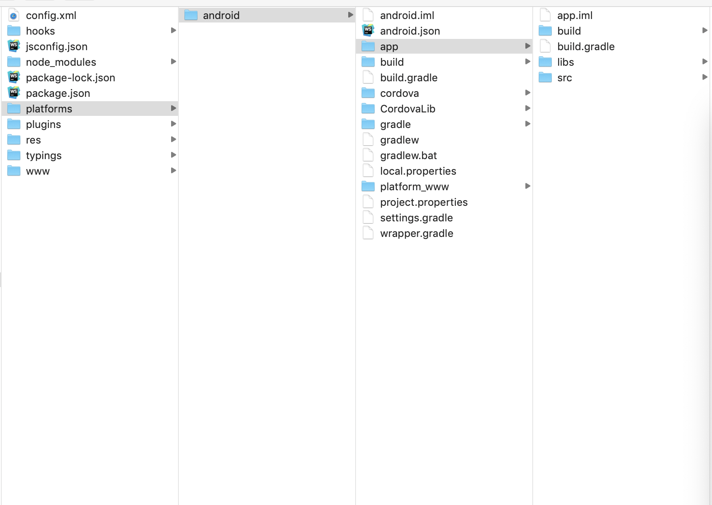

## 快速开始

- 本插件是基于会捷通 SDK 封装的 Cordova 插件，目前只提供 Android 版本

- 本插件的 demo 工程代码在 [https://github.com/hexmeet/cordova-demo-HJT-SDK-Android.git](https://github.com/hexmeet/cordova-demo-HJT-SDK-Android.git)， 有关 demo 工程和本插件的使用方法请参考其中的 README 文件

- 在 demo 工程中，添加 HJT Plugin 后，需要手工修改一下 Android 工程目录中的 build.gradle 文件

- 建议使用 Cordova 8.1.2 版本（9.0 以上版本暂不支持）


#### 打开文件 paltforms / android / app / build.gradle

如图：




在文件中添加：

```java
repositories {
    maven {
        url 'http://maven.aliyun.com/nexus/content/repositories/releases/'
    }
    flatDir {
        dirs 'libs'   // aar目录
    }
}
```

找见 dependencies  如下：

```
dependencies {
    implementation fileTree(dir: 'libs', include: '*.jar')
    // SUB-PROJECT DEPENDENCIES START
    implementation(project(path: ":CordovaLib"))
    // SUB-PROJECT DEPENDENCIES END
  }
```

添加如下代码：

```java
dependencies {
    
	implementation fileTree(include: ['*.aar'], dir: 'libs')
    implementation 'com.android.support:support-v4:24.0.0'
    implementation 'com.google.code.gson:gson:2.8.0'
    implementation 'com.android.support:multidex:1.0.3'
    implementation 'com.squareup.picasso:picasso:2.5.2'
    implementation 'com.andreabaccega:android-form-edittext:1.3.+'
    implementation 'com.lsjwzh:materialloadingprogressbar:0.5.8-RELEASE'
    implementation 'com.aliyun.ams:alicloud-android-man:1.2.0'
    implementation 'com.android.support.constraint:constraint-layout:1.1.3'
    implementation 'pl.droidsonroids.gif:android-gif-drawable:1.2.15'
    implementation files('libs/android-logging-log4j-1.0.2.jar')
    implementation files('libs/android-support-v7-recyclerview.jar')
    implementation files('libs/commons-lang3-3.2.1.jar')
    implementation files('libs/converter-gson-2.1.0.jar')
    implementation files('libs/eventbus-3.1.0-RC.jar')

    implementation files('libs/httpmime-4.5.2.jar')
    implementation files('libs/libammsdk.jar')
    implementation files('libs/log4j-1.2.17.jar')
    implementation files('libs/logging-interceptor-3.4.1.jar')
    implementation files('libs/okio-1.11.0.jar')
        
}
```

> Last Updated: Wed May 29 19:20:17 CST 2019 (e6b555b9cc0dcd27be67c7e9290038e5ff2fd0d6)
